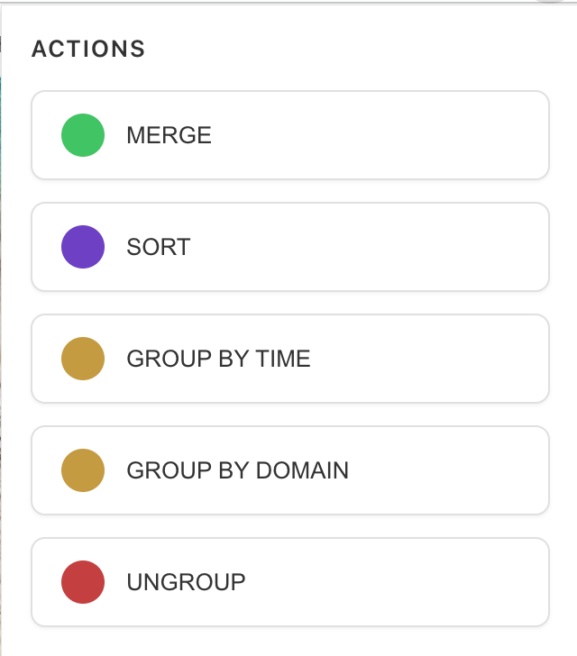

# MergeX

> A Chrome extension for efficient tab management, built with Vite + Vanilla JS using Manifest V3.

## Features

- 🔄 Merge Tabs: Combine tabs from multiple windows into one
- 📊 Smart Sort: Automatically sort tabs by domain name
- 👥 Group Management: Auto-group tabs by domain（by domain name or by time）
- 🔍 Quick Actions: Clean interface with one-click operations



## Installation

1. Clone the repository
```bash
git clone https://github.com/abcdlsj/mergex.git
cd mergex
```

2. Install dependencies (Node.js >= 14 required)
```bash
npm install
```

3. Build the extension
```bash
npm run build
```

4. Load in Chrome
- Open Chrome and navigate to `chrome://extensions/`
- Enable "Developer mode" in the top right
- Click "Load unpacked" and select the `build` directory from the project

## Usage

1. Click the MergeX icon in the browser toolbar
2. The popup panel provides four main functions:
   - MERGE: Combine all tabs from different windows
   - SORT: Sort tabs by domain name in current window
   - GROUP: Group tabs by domain name
   - UNGROUP: Remove all tab groupings

## Development

### Development mode

```bash
npm run dev
```

### Build for production

```bash
npm run build
```

### Package for distribution

```bash
npm run zip
```

## Tech Stack

- Vite
- Vanilla JavaScript
- Chrome Extension Manifest V3
- CRXJS

## Contributing

1. Fork the repository
2. Create your feature branch (`git checkout -b feature/AmazingFeature`)
3. Commit your changes (`git commit -m 'Add some AmazingFeature'`)
4. Push to the branch (`git push origin feature/AmazingFeature`)
5. Open a Pull Request

## License

This project is licensed under the MIT License - see the [LICENSE](LICENSE) file for details

## Author

- **abcdlsj** - [GitHub](https://github.com/abcdlsj)

## Acknowledgments

- [create-chrome-ext](https://github.com/guocaoyi/create-chrome-ext) - Project template
